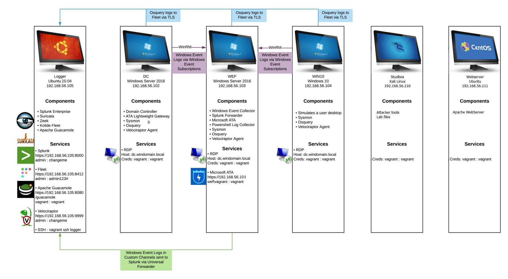

# Installation

* Download [Vagrant](https://releases.hashicorp.com/vagrant/2.2.19/vagrant_2.2.19_x86_64.msi)
* Download [Virtualbox](https://download.virtualbox.org/virtualbox/6.1.30/VirtualBox-6.1.30-148432-Win.exe)
* Download [Virtualbox Extension](https://download.virtualbox.org/virtualbox/6.1.30/Oracle_VM_VirtualBox_Extension_Pack-6.1.30.vbox-extpack)
* run `powershell -ep bypass`
* cd DetectionLab\Vagrant folder
* run `.\prepare.sh`
* `vagrant up --provider=virtualbox`

# Infrastructure

# Lab1

Using velociraptor identify how WIN10 was compromised, inspect running processes did you notice something suspicious?

# Lab2

LEVEL 1 QUESTIONS:
1) What is the IP address of the Windows VM that gets infected?
2) What is the host name of the Windows VM that gets infected?
3) What is the MAC address of the infected VM?
4) What is the IP address of the compromised web site?
5) What is the domain name of the compromised web site?
6) What is the IP address and domain name that delivered the exploit kit and malware?
7) What is the domain name that delivered the exploit kit and malware?
 

LEVEL 2 QUESTIONS:
1) What is the redirect URL that points to the exploit kit (EK) landing page?
2) Besided the landing page (which contains the CVE-2013-2551 IE exploit), what other exploit(s) sent by the EK?
4) How many times was the payload delivered?
5) Submit the pcap to VirusTotal and find out what snort alerts triggered.  What are the EK names are shown in the Suricata alerts?

PCAP is located on `studbox` in `/home/vagrant/lab2.pcap`

# Lab3

You work as a security analyst for a company with locations world-wide, and it recently opened a field office in Japan.

On Tuesday 2017-06-27, you notice several high-priority alerts from two different Intrusion Detection Systems (IDS).  One IDS is running Snort using the Snort subscription ruleset, and the other is running Suricata using the EmergingThreats Pro ruleset.

The results indicate a Windows computer was infected at your company's Japan field office.  You are tasked to investigate!  You have the pcap, a text file containing the Snort alerts, and a text file containing the Suricata alerts.

For this traffic analysis exercise, please answer the following questions:

* What is the MAC address, IP address, and host name of the infected Windows computer?
* What is the date and time (in UTC) the computer was infected?
* Based on the Snort and Suricata alerts, what was the computer infected with?
* Based on indicators from first HTTP GET request, determine how the computer was infected.
* Based on the previous answer, what is the SHA256 hash for the file that probably infected the computer?
* The pcap contains 3 Windows executable files sent over HTTP.  Export them from the pcap.  What are the SHA256 file hashes of the those 3 files?

Note:  Times for the Suricata alerts are not correct, because they were generated using tcpreplay some hours after the original infection.

You feel bad for the businessman who infected his computer at the company's Japan field office.  Rumor has it he's been forced to use a tablet while his computer is getting fixed.

PCAP of traffic is located on `studbox` machine in `/home/vagrant/2017-06-28-traffic-analysis-exercise.pcap`
Snort and suricata alerts `/home/vagrant/2017-06-28-traffic-analysis-exercise-Suricata-alerts.txt` `/home/vagrant/2017-06-28-traffic-analysis-exercise-Snort-alerts.txt`

# Lab4

# Lab5

Sensitive information of company called Super Secure Startup was leaked, find how it was possible.
`/home/vagrant/lab5.zip` located on `studbox` was decrypted find how hackers could extract it using publicly available information.

# Lab6

From studbox using techniques learned during the course scan 192.168.56.0/24 enumerate services available and identify vulnerabilities that can be exploitable. Create report containing identified vulnerabilities and running services.

# Lab7

Exploit vulnerablity in apache web server.

# Lab8

Inspect PCAP located at `/home/vagrant/PCAP_sample/Command and Control/cmds over dns txt queries and reponses.pcap` identify how communication channel was established using DNS records.
